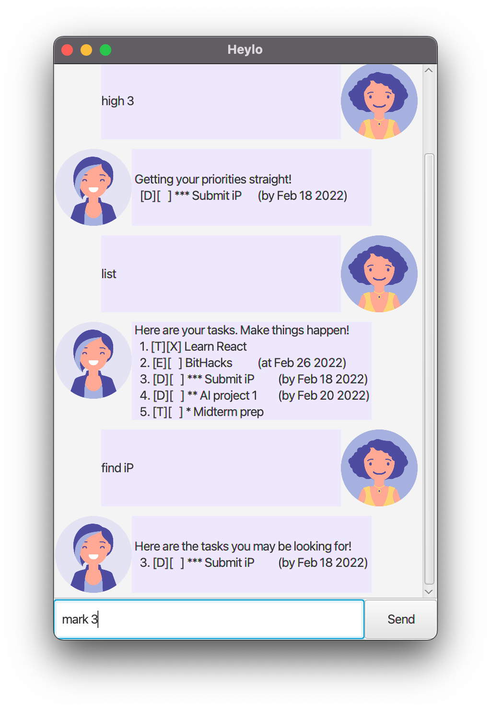

[credits - referred to AB-3 User Guide for inspiration]::

# User Guide

Heylo is a **desktop app for managing your day-to-day tasks with a friendly chatbot** while still having the speed of a
Graphical User Interface (GUI).

--------------------------------------------------------------------------------------------------------------------

## Quick start

1. Make sure you have Java `11` or above installed in your computer.

2. Download the latest `heylo.jar` from the [Releases](https://github.com/ckcherry23/ip/releases) page of Heylo's
   repository.

3. Double-click the downloaded file to start the app. The GUI similar to this should appear.<br>
   

4. Refer to the [Usage](#usage) below for the details of each command supported.

5. Type your command in the command box and press Enter or the Send button to let Heylo respond to it.

6. Skyrocket your productivity!

--------------------------------------------------------------------------------------------------------------------

## Features

- [x] Viewing all tasks 🤓
- [x] Adding todos 📝
- [x] Noting events 🎃
- [x] Managing deadlines 📅
- [x] Marking tasks as done ✅
- [x] Deleting tasks 🗑
- [x] Searching for tasks 🔍
- [x] Prioritising tasks 🌟


- [x] User-friendly 😇
- [x] Optimised for keyboard lovers 😍
- [x] Cross-platform support 👩🏽‍💻

## Usage

**Notes about the command format**<br>

* Words in `<Angular brackets>` are the details to be supplied by the user without the brackets.<br>
  e.g. in `todo <description>`, `todo` is a parameter which can be used as `todo complete quiz 3`.


* Extra details for commands that do not take in parameters (such as `list`) will be ignored.<br>
  e.g. if the command specifies `list few`, it will be interpreted as `list`.

### Viewing all tasks: `list`

Lists all the tasks managed by the Heylo app.

Format: `list`

### Adding todos : `todo`

Adds a simple todo to the task list with your specified description.

Format: `todo <description>`

### Noting events: `event`

Adds an event along with the date it will occur on to the task list.

Format: `event <description> /at <yyyy-mm-dd>`

* Make sure you provide the date in the specified `yyyy-mm-dd` format.

### Managing deadlines : `deadline`

Adds a task along with the date of its deadline to the task list.

Format: `deadline <description> /by <yyyy-mm-dd>`

* Make sure you provide the date in the specified `yyyy-mm-dd` format.

### Marking tasks as done : `mark`

Marks a task as done.

Format: `mark <index>`

* The `index` is the number of the task you want to mark as done in the list displayed by Heylo with the `list` command.

### Marking tasks as not done : `unmark`

Marks a task as not done.

Format: `unmark <index>`

* The `index` is the number of the task you want to mark as done in the list displayed by Heylo with the `list` command.

### Deleting tasks : `delete`

Deletes a task from your task list.

**Caution:**
This is an irreversible action.

Format: `delete <index>`

* The `index` is the number of the task you want to mark as done in the list displayed by Heylo with the `list` command.

### Searching for tasks: `find`

Finds tasks that match the input that you have entered and lists them according to their index in the task list.

Format: `find <search-string>`

### Mark tasks as low priority: `low`

Marks the specified task as low priority with a `*` prefix.

Format: `low <index>`

* The `index` is the number of the task you want to mark as done in the list displayed by Heylo with the `list` command.

### Mark tasks as medium priority: `med`

Marks the specified task as medium priority with a `**` prefix.

Format: `med <index>`

* The `index` is the number of the task you want to mark as done in the list displayed by Heylo with the `list` command.

### Mark tasks as high priority: `high`

Marks the specified task as high priority with a `***` prefix.

Format: `high <index>`

* The `index` is the number of the task you want to mark as done in the list displayed by Heylo with the `list` command.

### Clear task priority: `no-p`

Removes the priority of the task.

Format: `no-p <index>`

* The `index` is the number of the task you want to mark as done in the list displayed by Heylo with the `list` command.


### Exit the chatbot: `bye`

Saves all your tasks and exits the application.

Format: `bye`

--------------------------------------------------------------------------------------------------------------------

## FAQ

**Q**: How do I transfer my data to another Computer?<br>

**A**: Install the app in the other computer and overwrite the empty data file it creates on running the app with data
from the file that was created by Heylo in your previous computer

--------------------------------------------------------------------------------------------------------------------

## Command summary

**List** | `list`

**Todo** | `todo <description>`

**Event** | `event <description> /at <yyyy-mm-dd>`

**Deadline** | `deadline <description> /by <yyyy-mm-dd>`

**Mark** | `mark <index>`

**Unmark** | `unmark <index>`

**Delete** | `delete <index>`

**Find** | `find <search-string>`

**Low priority** | `low <index>`

**Medium priority** | `med <index>`

**High priority** | `high <index>`

**No priority** | `no-p <index>`

**Exit** | `bye`

[//]: # (# User Guide)

[//]: # ()

[//]: # (## Features)

[//]: # ()

[//]: # (### Feature-ABC)

[//]: # ()

[//]: # (Description of the feature.)

[//]: # ()

[//]: # (### Feature-XYZ)

[//]: # ()

[//]: # (Description of the feature.)

[//]: # ()

[//]: # (## Usage)

[//]: # ()

[//]: # (### `Keyword` - Describe action)

[//]: # ()

[//]: # (Describe the action and its outcome.)

[//]: # ()

[//]: # (Example of usage:)

[//]: # ()

[//]: # (`keyword &#40;optional arguments&#41;`)

[//]: # ()

[//]: # (Expected outcome:)

[//]: # ()

[//]: # (Description of the outcome.)

[//]: # ()

[//]: # (```)

[//]: # (expected output)

[//]: # (```)
